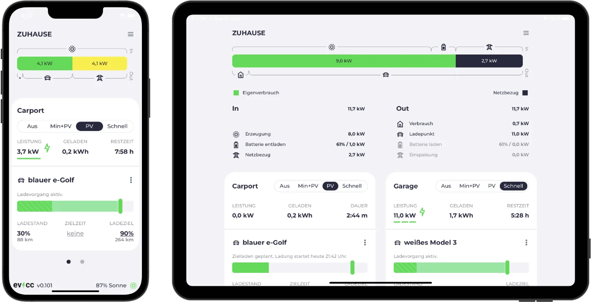
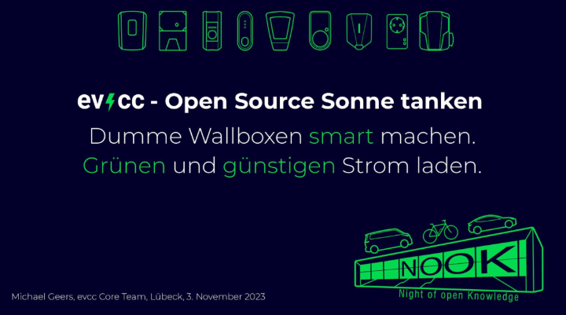
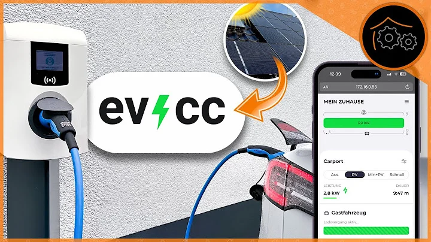

# Introduction

evcc controls Electric Vehicle (EV) charging as required to optimise for the current energy situation.
A Photovoltaic (PV) system can be connected in order to charge the EV with as much self-produced energy as possible, and/or grid providers can be connected to allow for exploitation of dynamic electricity prices.

Normally, the wallbox must be compatible with the existing PV installation, often requiring equipment from the same manufacturer. However, evcc works across manufacturers and with a wide variety of wallboxes, electricity measuring devices, and PV inverters, without requiring specific manufacturer compatibility between them.

evcc is installed onto a system in the local network, so that it can communicate properly with all the necessary devices. It does this completely locally, and without any reliance on cloud connectivity (though connected components may have their own requirements). The software itself is very lean, and something like a NAS (network attached storage) or a Raspberry Pi (or similar) is completely sufficient to achieve full functionality.

## Functionality

- Simple and clear User Interface
- Support for
  - [Wallboxes & Switchable Sockets](/docs/devices/chargers)
  - [Inverters, Battery Storage, & Energy Meters](/docs/devices/meters)
  - [Vehicles](/docs/devices/vehicles)
- [Plugins](/docs/reference/plugins) support a wide variety of wallboxes, meters, & vehicles over Modbus, HTTP, MQTT, JavaScript, Websockets, and Shell Scripts
- Status [Notifications](/docs/reference/configuration/messaging) via [Telegram](https://telegram.org), [PushOver](https://pushover.net) and [many more](https://containrrr.dev/shoutrrr/)
- Data Export via [InfluxDB](https://www.influxdata.com) and [Grafana](https://grafana.com/grafana/)
- Stepless regulation of charging flows with supported wall boxes (e.g the smartWB's [OLC](https://board.evse-wifi.de/viewtopic.php?f=16&t=187) functionality)
- Rest & MQTT [APIs](/docs/reference/api) for integration into other home automation systems (such as [Home Assistant](https://github.com/evcc-io/evcc-hassio-addon))

## Requirements

evcc requires at least the following:

- a supported [Wallbox or Switchable Socket](/docs/devices/chargers)
- a supported [Energy Meter](/docs/devices/meters) at the house connection, or alternatively a supported PV inverter / other metering device that can measure current energy production
- a supported system to run evcc on!

Optionally:

- one or more supported [Vehicles](/docs/devices/vehicles) to collect charge status / level information
- additional supported Wallboxes or Switchable Sockets
- supported PV inverter(s)
- supported Battery Storage System(s)
- a supported [Energy Management System](/docs/reference/configuration/hems) (such as SMA Sunny Home Manager)
- information on a dynamic electricity tariff

:::note
evcc comes without any kind of guarantee, and you use the software at your own risk. It is your responsibility to use evcc responsibly - it's your house fire!
:::

## Contact

- Support, configurations, questions about devices, and general discussion can be found in our [Community Support Forum](https://github.com/evcc-io/evcc/discussions).
- We also have a [Slack](https://evcc.io/slack) for development discussion.

## Videos

:::note
Currently DE only (but please do suggest other languages!)
:::

### Night of open Knowledge 2023 in Lübeck Lecture

[Michael](https://github.com/naltatis) gives an overview of the functionality and possibilities of evcc.

Here are [the slides](https://speakerdeck.com/naltatis/evcc-open-source-sonne-tanken).

### Linux Infotag 2023 Lecture

[Michael](https://github.com/naltatis) introduces the project, talks about everyday work, and financing.

### verdrahtet: PV surplus with evcc

Tackles evcc basics, integration with ioBroker, and integrating a homematic switch.

### haus-automatisierung.com: Charging an Electric Vehicle with PV Surplus

Tackles evcc basics, custom plugins, control via MQTT and ioBroker, as well as different installation options.

## Articles

### hobbyblogging.de

- Einführung in die Grundkonzepte: [evcc - Was soll das sein?](https://hobbyblogging.de/evcc-was-soll-das-sein)
- Einrichtung mit Balkonsolar und smarten Steckdosen: [evcc installieren - So einfach geht's!](https://hobbyblogging.de/evcc-installieren)

### elefacts.de

- Grundlagen, Detaillierte Anleitung für Raspberry Pi Installation, Fernzugriff via Fritz!Box & DynDNS: [evcc Anleitung für intelligentes PV Überschussladen mit vielen Wallboxen](https://www.elefacts.de/test-206-evcc_anleitung_fuer_intelligentes_pv_ueberschussladen_mit_vielen_wallboxen)
- InfluxDB & Grafana: [Von evcc erfasste Daten langfristig speichern und aufbereiten](https://www.elefacts.de/test-208-von_evcc_erfasste_daten_langfristig_speichern_und_aufbereiten)

### the-ninth.com

- [A closer look at the inner workings of evcc](https://www.the-ninth.com/blog/a-closer-look-at-the-inner-workings-of-evcc)
- [Running evcc in our second home with Fronius](https://www.the-ninth.com/blog/running-evcc-in-our-second-home-with-fronius)
- [Running evcc on Synology with Huawei, go-e and VW](https://www.the-ninth.com/blog/running-evcc-synology-huawei-go-e-vw)
- [Comparing evcc and the go-e Controller for solar charging](https://www.the-ninth.com/blog/comparing-evcc-go-e-controller)
